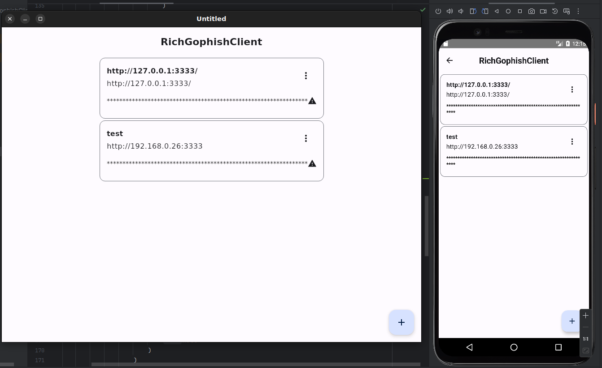
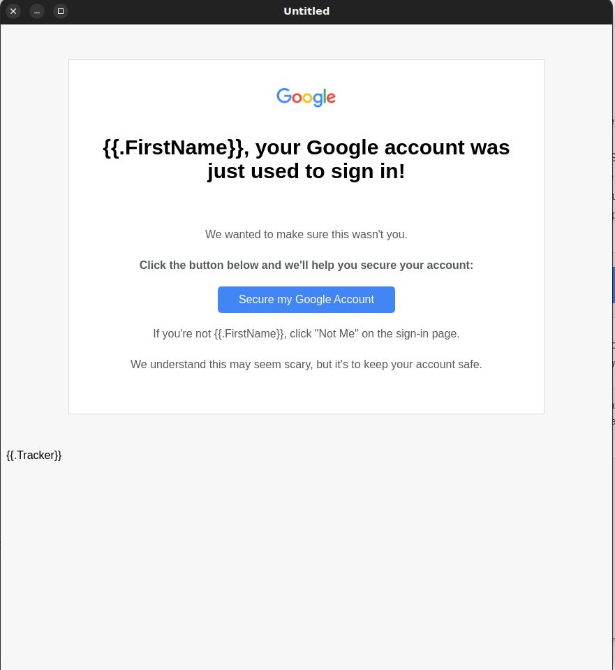
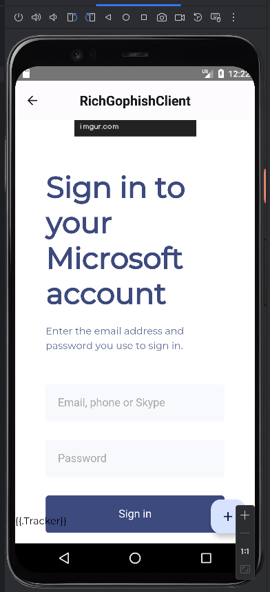
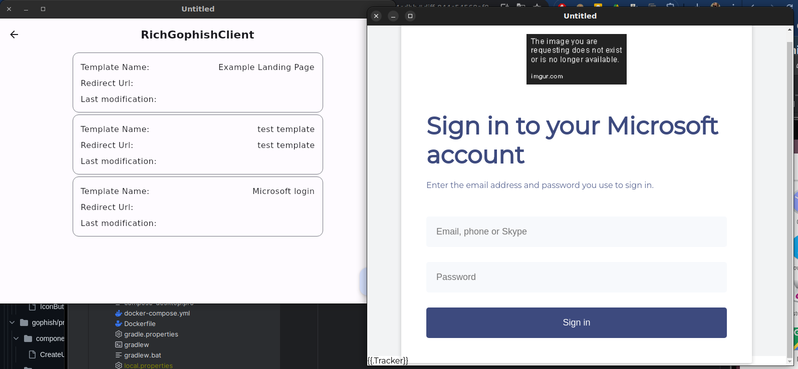

# RichGophishClient

RichGophishClient (not yet 🤥) is a Kotlin Multiplatform (KMM) application designed for all platforms without web support. It features a simple Ktor server facilitating Gophish multi-tenancy. This application enables users to manage multiple credentials within a SQLite database. The shared folder contains models, repositories and other components crucial for the servers calls. Additionally, it integrates an AI-powered email generation system via the Ollama API, enhancing email campaign effectiveness and personalization.

## Features

Features
- Multi-Tenancy: RichGophishClient allows for the efficient management of multiple Gophish instances within a single application.
- AI-Powered Email/Page Generation: The integration of the Ollama API enables the generation of personalized and effective emails, enhancing user experience and campaign effectiveness.
- Some ui charts from compose library :)

## Requirements

1. GoPhish Instance: The program requires access to at least one GoPhish instance with an accessible API. GoPhish is an open-source phishing framework that can be utilized for various security testing purposes. Ensure that your GoPhish instance is configured to allow API access.[Gophish](https://getgophish.com/)
2. Ollama: The program supports running various large language models including Llama 3, Phi 3, Mistral, Gemma, and others. Ensure that you have the necessary resources and configurations to run these models effectively. [Ollama](https://ollama.com/)


## Installation

1. Local build (prefered way)
   To try out RichGophishClient, follow these steps:
- Clone repo
```bash
git clone https://github.com/matiz22/RichGophishClient.git
```
- Navigate to the project directory:
```bash
cd RichGophishClient
```
- Set up the server environment:

The server requires an environment variable to pass the API_KEY, which is used for authorization client and server. Ensure you have the API key ready.

Example:
```bash
export API_KEY=your_api_key_here
```
or .env file
```env
API_KEY=your_api_key_here
```

- Configure client properties
  Create or modify the local.properties. This file should contain the necessary configurations for the client to connect to the server and the Ollama API.

Example local.properties:
```gradlew
main.api.host=192.168.0.26:8080        # Location of the server JAR
main.api.key=test                      # API_KEY which is set on server
ollama.api.host=127.0.0.1:11434        # Location of the Ollama API
ollama.email.model=emailcreator        # Name of model which can create emails
ollama.page.model=pagecreator          # Name of model which can create pages
```
- Build the server JAR:
```bash
./gradlew :server:build
```
Use android studio to run or execute a specific gradle task

Examples
```bash
./gradlew :composeApp:run
```
```bash
./gradlew :composeApp:packageDistributionForCurrentOS 
```

2. Use release packages from github, for test purpose

## Screenshots






## Tech Stack

### Core Libraries

- [**Decompose:**](https://github.com/arkivanov/Decompose) Provides utilities for composing reusable UI components.
- [**Dotenv Kotlin:**](https://github.com/cdimascio/dotenv-kotlin) Loads environment variables from a file.
- [**Exposed:**](https://github.com/JetBrains/Exposed) ORM library for Kotlin.

### Persistence

- **H2:** Embedded relational database.

### Security

- **Jbcrypt:** Password hashing library.


### Dependency Management

- **Koin** Dependency injection framework for Kotlin.


### Useful Libraries

- [**Libres:**](https://github.com/Skeptick/libres) Collection of utilities for Kotlin projects.
- [**Yshrsmz-BuildKonfig:**](https://github.com/yshrsmz/BuildKonfig) Library for managing project configurations.
- [**compose-webview-multiplatform**](https://github.com/Skeptick/libres) WebView for JetBrains Compose Multiplatform